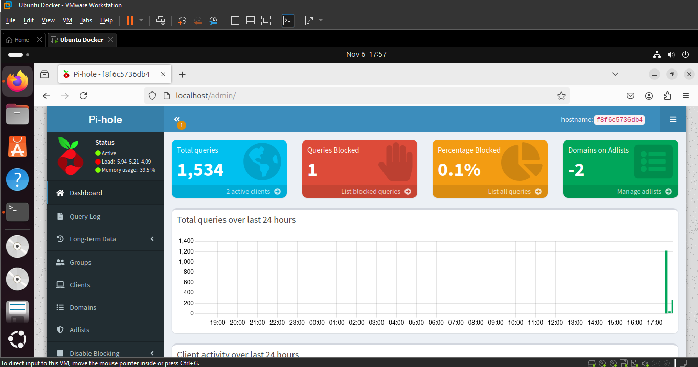

# Summary:

This documentation goes through installing Docker Engine and setting up a PiHole container on Ubuntu 24.04.1 LTS (Noble Numbat).

[!WARNING] Do not run the result of this assignment with an IP besides localhost if your system isn't properly secured.
iptables works best with Docker containers. 

# Tips:

1. To enable copy-and-paste functionality between your host system and an Ubuntu VM in VMWare

  a. Install VMware Tools:

 ```
 sudo apt update
 sudo apt install open-vm-tools open-vm-tools-desktop
 ```

  b. Restart the VM

# Install Docker Engine using the apt repository 
These Instructions are based off of https://docs.docker.com/engine/install/ubuntu/

1. Set up Docker's apt repository.

```
# Add Docker's official GPG key:
sudo apt-get update
sudo apt-get install ca-certificates curl
sudo install -m 0755 -d /etc/apt/keyrings
sudo curl -fsSL https://download.docker.com/linux/ubuntu/gpg -o /etc/apt/keyrings/docker.asc
sudo chmod a+r /etc/apt/keyrings/docker.asc

# Add the repository to Apt sources:
echo \
  "deb [arch=$(dpkg --print-architecture) signed-by=/etc/apt/keyrings/docker.asc] https://download.docker.com/linux/ubuntu \
  $(. /etc/os-release && echo "$VERSION_CODENAME") stable" | \
  sudo tee /etc/apt/sources.list.d/docker.list > /dev/null
sudo apt-get update
```

2. Install the Docker packages.
```
sudo apt-get install docker-ce docker-ce-cli containerd.io docker-buildx-plugin docker-compose-plugin
```

3. Verify that the Docker Engine installation is successful by running the hello-world image.
```
 sudo docker run hello-world
 ```

4. Add yourself to Docker Group (Optional but recommended)
```
sudo usermod -aG docker username
```

5. Check that Docker Installed Correctly
```
sudo docker run hello-world
```

6. Check that Compose Installed Correctly
```
sudo docker compose version
```

# Install PiHole via a Docker Container
These Instructions are based off of https://github.com/pi-hole/docker-pi-hole

1. Create a directory for PiHole:
```
mkdir ~/pihole && cd ~/pihole
```

2. Create a docker-compose.yml file:
```
nano docker-compose.yml
```

Paste these contents into the compose file.

```
# More info at https://github.com/pi-hole/docker-pi-hole/ and https://docs.pi-hole.net/
services:
  pihole:
    container_name: pihole
    image: pihole/pihole:latest
    # For DHCP it is recommended to remove these ports and instead add: network_mode: "host"
    ports:
      - "53:53/tcp"
      - "53:53/udp"
      - "67:67/udp" # Only required if you are using Pi-hole as your DHCP server
      - "80:80/tcp"
    environment:
      TZ: 'America/Chicago'
      # WEBPASSWORD: 'set a secure password here or it will be random'
    # Volumes store your data between container upgrades
    volumes:
      - './etc-pihole:/etc/pihole'
      - './etc-dnsmasq.d:/etc/dnsmasq.d'
    #   https://github.com/pi-hole/docker-pi-hole#note-on-capabilities
    cap_add:
      - NET_ADMIN # Required if you are using Pi-hole as your DHCP server, else not needed
    restart: unless-stopped
```

3. Log in to Docker
```
docker login
```

4. Build and Start PiHole
```
docker compose up -d
```

5. Use the Pi-hole web UI 
  a. Visit http://localhost:80/admin/ on your browser
  b. Reset your password
  ```
  docker exec -it pihole pihole -a -p
  ```



6. Shut Down the container
docker compose down

