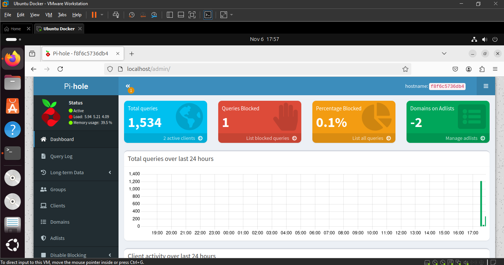

# Summary:

This documentation goes through installing Docker Engine and setting up a PiHole container on Ubuntu 24.04.1 LTS (Noble Numbat).

Warning: Do not run the result of this assignment with an IP besides localhost if your system isn't properly secured.
This documentation will set up PiHole with localhost.
iptables works best with Docker containers. 

# Tips:

1. To enable copy-and-paste functionality between your host system and an Ubuntu VM in VMWare

  a. Install VMware Tools:

 ```
 sudo apt update
 sudo apt install open-vm-tools open-vm-tools-desktop
 ```

  b. Restart the VM

# Install Docker Engine using the apt repository 
These Instructions are based off of https://docs.docker.com/engine/install/ubuntu/

1. Set up Docker's apt repository.

```
# Add Docker's official GPG key:
sudo apt-get update
sudo apt-get install ca-certificates curl
sudo install -m 0755 -d /etc/apt/keyrings
sudo curl -fsSL https://download.docker.com/linux/ubuntu/gpg -o /etc/apt/keyrings/docker.asc
sudo chmod a+r /etc/apt/keyrings/docker.asc

# Add the repository to Apt sources:
echo \
  "deb [arch=$(dpkg --print-architecture) signed-by=/etc/apt/keyrings/docker.asc] https://download.docker.com/linux/ubuntu \
  $(. /etc/os-release && echo "$VERSION_CODENAME") stable" | \
  sudo tee /etc/apt/sources.list.d/docker.list > /dev/null
sudo apt-get update
```

2. Install the Docker packages.
```
sudo apt-get install docker-ce docker-ce-cli containerd.io docker-buildx-plugin docker-compose-plugin
```

3. Verify that the Docker Engine installation is successful by running the hello-world image.
```
 sudo docker run hello-world
 ```

4. Add yourself to Docker Group (Optional but recommended)
```
sudo usermod -aG docker username
```

5. Check that Docker Installed Correctly
```
sudo docker run hello-world
```

6. Check that Compose Installed Correctly
```
sudo docker compose version
```

# Install PiHole via a Docker Container
These Instructions are based off of https://github.com/pi-hole/docker-pi-hole

1. Create a directory for PiHole:
```
mkdir ~/pihole && cd ~/pihole
```

2. Create a docker-compose.yml file:
```
nano docker-compose.yml
```

Paste these contents into the compose file.

```
# More info at https://github.com/pi-hole/docker-pi-hole/ and https://docs.pi-hole.net/
services:
  pihole:
    container_name: pihole
    image: pihole/pihole:latest
    # For DHCP it is recommended to remove these ports and instead add: network_mode: "host"
    ports:
      - "53:53/tcp"
      - "53:53/udp"
      - "67:67/udp" # Only required if you are using Pi-hole as your DHCP server
      - "80:80/tcp"
    environment:
      TZ: 'America/Chicago'
      # WEBPASSWORD: 'set a secure password here or it will be random'
    # Volumes store your data between container upgrades
    volumes:
      - './etc-pihole:/etc/pihole'
      - './etc-dnsmasq.d:/etc/dnsmasq.d'
    #   https://github.com/pi-hole/docker-pi-hole#note-on-capabilities
    cap_add:
      - NET_ADMIN # Required if you are using Pi-hole as your DHCP server, else not needed
    restart: unless-stopped
```

3. Log in to Docker
```
docker login
```

4. Build and Start PiHole
```
docker compose up -d
```

5. Use the Pi-hole web UI 
  a. Visit http://localhost:80/admin/ on your browser
  b. Reset your password
  ```
  docker exec -it pihole pihole -a -p
  ```



6. Shut Down the container
docker compose down

